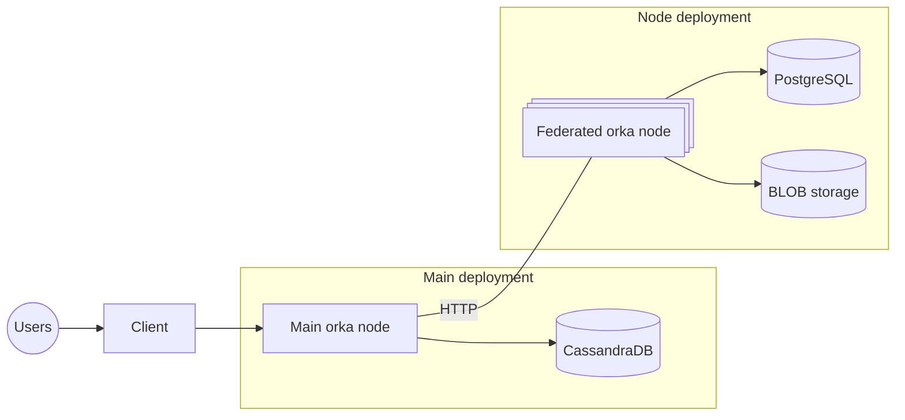

# orka

orka is an open source community-based semi-federated social network project written in rust

## Main architecture

Users should be able to use a client to connect to the main orka nodes, which handle operations like content moderation, user access, federation access, and handover the user to the federated orka nodes which handle the actual communities, posts, and user data. 